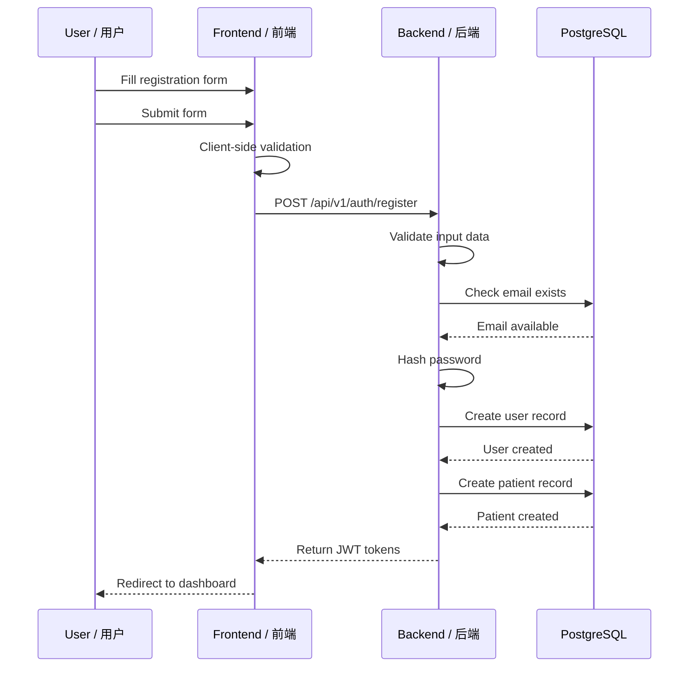
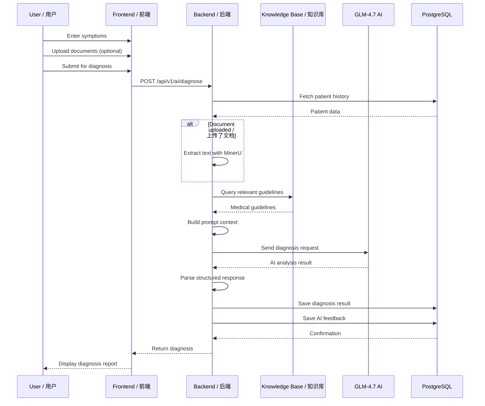

# System Architecture | 系统架构

> **MediCare_AI** 系统架构设计文档 / System Architecture Design Document
>
> **Version | 版本:** 1.0.0 | **Last Updated | 更新日期:** 2025-02-01

---

## 📋 Table of Contents | 目录

1. [Overview | 概述](#overview)
2. [Architecture Diagram | 架构图](#architecture-diagram)
3. [Component Details | 组件详情](#component-details)
4. [Data Flow | 数据流](#data-flow)
5. [Database Design | 数据库设计](#database-design)
6. [Security Architecture | 安全架构](#security-architecture)
7. [Scalability | 可扩展性](#scalability)

---

<a name="overview"></a>
## 1. Overview | 概述

### 1.1 Purpose | 目的

This document describes the architecture of the MediCare_AI system, an intelligent disease management platform that combines AI-powered diagnosis with comprehensive patient management.

本文档描述了 MediCare_AI 系统的架构，这是一个结合 AI 智能诊断和全面患者管理的智能疾病管理平台。

### 1.2 Design Goals | 设计目标

| Goal | Description | 目标 | 描述 |
|------|-------------|------|------|
| **Scalability** | Handle growing user base and data | 可扩展性 | 处理不断增长的用户和数据 |
| **Reliability** | 99.9% uptime with proper monitoring | 可靠性 | 通过适当监控实现 99.9% 正常运行时间 |
| **Security** | HIPAA-compliant data protection | 安全性 | 符合 HIPAA 的数据保护 |
| **Performance** | < 2s API response time | 性能 | API 响应时间小于 2 秒 |
| **Maintainability** | Clean code with comprehensive docs | 可维护性 | 代码整洁，文档完善 |

### 1.3 Technology Stack | 技术栈

```
┌─────────────────────────────────────────────────────────────┐
│                    Frontend Layer 前端层                    │
├─────────────────────────────────────────────────────────────┤
│  HTML5 + CSS3 + JavaScript (Vanilla)                        │
│  • No build step required                                   │
│  • Responsive design with CSS Grid/Flexbox                  │
│  • Fetch API for HTTP requests                              │
└─────────────────────────────────────────────────────────────┘
                              │
                              ▼
┌─────────────────────────────────────────────────────────────┐
│                   API Gateway Layer 网关层                  │
├─────────────────────────────────────────────────────────────┤
│  Nginx Reverse Proxy                                        │
│  • SSL/TLS termination                                      │
│  • Rate limiting                                            │
│  • Static file serving                                      │
│  • Load balancing                                           │
└─────────────────────────────────────────────────────────────┘
                              │
                              ▼
┌─────────────────────────────────────────────────────────────┐
│                   Application Layer 应用层                  │
├─────────────────────────────────────────────────────────────┤
│  FastAPI (Python 3.11)                                      │
│  • Async request handling                                   │
│  • Automatic API documentation (OpenAPI/Swagger)            │
│  • Pydantic data validation                                 │
│  • Dependency injection                                     │
└─────────────────────────────────────────────────────────────┘
                              │
                              ▼
┌─────────────────────────────────────────────────────────────┐
│                    Service Layer 服务层                     │
├─────────────────────────────────────────────────────────────┤
│  • UserService      - Authentication & user management      │
│  • PatientService   - Patient CRUD operations               │
│  • AIService        - AI diagnosis integration              │
│  • DocumentService  - File upload & management              │
│  • MinerUService    - Document text extraction              │
│  • KnowledgeBaseService - Medical guidelines                │
└─────────────────────────────────────────────────────────────┘
                              │
                              ▼
┌─────────────────────────────────────────────────────────────┐
│                    Data Layer 数据层                        │
├─────────────────────────────────────────────────────────────┤
│  PostgreSQL 17 (Primary DB)                                 │
│  Redis 7.4 (Cache & Sessions)                               │
│  File System (Uploads)                                      │
└─────────────────────────────────────────────────────────────┘
```

---

<a name="architecture-diagram"></a>
## 2. Architecture Diagram | 架构图

### 2.1 High-Level Architecture | 高层架构

```
                              Users / 用户
                                  │
                                  ▼
                    ┌─────────────────────────┐
                    │   Browser / Mobile App  │
                    │   浏览器 / 移动应用      │
                    └───────────┬─────────────┘
                                │ HTTPS
                                ▼
                    ┌─────────────────────────┐
                    │    Nginx (Port 443)     │
                    │   SSL/Termination       │
                    │   SSL 终止              │
                    └───────────┬─────────────┘
                                │
                ┌───────────────┼───────────────┐
                │               │               │
        ┌───────▼──────┐ ┌──────▼──────┐ ┌──────▼──────┐
        │   Frontend   │ │   Backend   │ │  API Docs   │
        │   (Static)   │ │   FastAPI   │ │  (Swagger)  │
        │   静态文件    │ │             │ │             │
        └──────────────┘ └──────┬──────┘ └─────────────┘
                                │
        ┌───────────────────────┼───────────────────────┐
        │                       │                       │
┌───────▼──────┐      ┌─────────▼─────────┐   ┌────────▼────────┐
│  PostgreSQL  │      │  External Services│   │      Redis      │
│   Database   │      │  外部服务         │   │     Cache       │
│   数据库      │      │                   │   │     缓存        │
│              │      │  • MinerU API     │   │                 │
│  • Users     │      │  • GLM-4.7 AI     │   │  • Sessions     │
│  • Patients  │      │                   │   │  • Rate Limit   │
│  • Cases     │      └───────────────────┘   │  • Cache        │
└──────────────┘                              └─────────────────┘
```

### 2.2 Component Interaction | 组件交互

```sequence
User->Frontend: 1. Access website
Frontend->Nginx: 2. Request static files
Nginx-->Frontend: 3. Return HTML/CSS/JS

User->Frontend: 4. Fill registration form
Frontend->Nginx: 5. POST /api/v1/auth/register
Nginx->Backend: 6. Forward request

Backend->PostgreSQL: 7. Create user record
PostgreSQL-->Backend: 8. Return user ID

Backend->PostgreSQL: 9. Create patient record
PostgreSQL-->Backend: 10. Confirm creation

Backend-->Nginx: 11. Return JWT token
Nginx-->Frontend: 12. Return auth response
Frontend-->User: 13. Redirect to dashboard

User->Frontend: 14. Submit symptoms
Frontend->Nginx: 15. POST /api/v1/ai/diagnose
Nginx->Backend: 16. Forward with JWT

Backend->PostgreSQL: 17. Fetch patient history
PostgreSQL-->Backend: 18. Return history

Backend->MinerU: 19. Extract document (if uploaded)
MinerU-->Backend: 20. Return extracted text

Backend->GLM-4.7: 21. Send diagnosis request
GLM-4.7-->Backend: 22. Return AI analysis

Backend->PostgreSQL: 23. Save diagnosis result
PostgreSQL-->Backend: 24. Confirm save

Backend-->Nginx: 25. Return diagnosis
Nginx-->Frontend: 26. Display results
Frontend-->User: 27. Show diagnosis report
```

---

<a name="component-details"></a>
## 3. Component Details | 组件详情

### 3.1 Frontend / 前端

**Technology:** HTML5 + CSS3 + Vanilla JavaScript

**File Structure:**
```
frontend/
├── index.html              # Dashboard / 首页仪表盘
├── login.html             # Login page / 登录页
├── register.html          # Registration / 注册页
├── user-profile.html      # Profile management / 个人中心
├── symptom-submit.html    # Symptom submission / 症状提交
└── medical-records.html   # Medical history / 诊疗记录
```

**Key Features | 关键特性:**
- Responsive design with CSS Grid/Flexbox / 使用 CSS Grid/Flexbox 的响应式设计
- JWT token storage in localStorage / JWT 令牌存储在 localStorage
- Fetch API for asynchronous requests / 使用 Fetch API 进行异步请求
- Form validation before submission / 提交前表单验证
- Modal dialogs for confirmations / 模态对话框用于确认

### 3.2 Backend / 后端

**Framework:** FastAPI (Python 3.11)

**Directory Structure:**
```
backend/app/
├── main.py                 # Application entry / 应用入口
├── api/
│   └── api_v1/
│       ├── api.py         # Router aggregation / 路由聚合
│       └── endpoints/
│           ├── auth.py    # Authentication / 认证
│           ├── patients.py # Patient CRUD / 患者管理
│           ├── ai.py      # AI diagnosis / AI 诊断
│           └── documents.py # File handling / 文件处理
├── core/
│   ├── config.py         # Configuration / 配置
│   ├── security.py       # JWT & passwords / JWT 和密码
│   └── deps.py          # Dependencies / 依赖注入
├── models/
│   └── models.py        # Database models / 数据库模型
├── schemas/
│   ├── user.py          # User schemas / 用户模式
│   └── patient.py       # Patient schemas / 患者模式
└── services/
    ├── user_service.py       # User business logic / 用户业务逻辑
    ├── patient_service.py    # Patient business logic / 患者业务逻辑
    ├── ai_service.py         # AI integration / AI 集成
    ├── document_service.py   # File management / 文件管理
    ├── mineru_service.py     # MinerU API client / MinerU API 客户端
    └── knowledge_base_service.py # Knowledge base / 知识库
```

**Service Layer Pattern | 服务层模式:**
```python
# Example service implementation / 服务实现示例
class PatientService:
    def __init__(self, db: AsyncSession):
        self.db = db
    
    async def create_patient(
        self, 
        patient_data: PatientCreate, 
        user_id: UUID
    ) -> Patient:
        # Business logic here
        db_patient = Patient(**patient_data.dict())
        self.db.add(db_patient)
        await self.db.commit()
        return db_patient
```

### 3.3 Database / 数据库

**Primary Database:** PostgreSQL 17

**Core Tables | 核心表:**

```sql
-- Users Table / 用户表
CREATE TABLE users (
    id UUID PRIMARY KEY DEFAULT uuid_generate_v4(),
    email VARCHAR(255) UNIQUE NOT NULL,
    password_hash VARCHAR(255) NOT NULL,
    full_name VARCHAR(255) NOT NULL,
    is_active BOOLEAN DEFAULT TRUE,
    is_verified BOOLEAN DEFAULT FALSE,
    created_at TIMESTAMP WITH TIME ZONE DEFAULT NOW(),
    updated_at TIMESTAMP WITH TIME ZONE DEFAULT NOW(),
    last_login TIMESTAMP WITH TIME ZONE
);

-- Patients Table / 患者表
CREATE TABLE patients (
    id UUID PRIMARY KEY DEFAULT uuid_generate_v4(),
    user_id UUID REFERENCES users(id) ON DELETE CASCADE,
    date_of_birth DATE,
    gender VARCHAR(10),
    phone VARCHAR(20),
    emergency_contact TEXT,
    address TEXT,
    medical_record_number VARCHAR(100) UNIQUE,
    created_at TIMESTAMP WITH TIME ZONE DEFAULT NOW(),
    updated_at TIMESTAMP WITH TIME ZONE DEFAULT NOW()
);

-- Medical Cases Table / 医疗病例表
CREATE TABLE medical_cases (
    id UUID PRIMARY KEY DEFAULT uuid_generate_v4(),
    patient_id UUID REFERENCES patients(id) ON DELETE CASCADE,
    title VARCHAR(255) NOT NULL,
    description TEXT,
    symptoms TEXT,
    diagnosis TEXT,
    severity VARCHAR(20),
    status VARCHAR(20) DEFAULT 'active',
    created_at TIMESTAMP WITH TIME ZONE DEFAULT NOW(),
    updated_at TIMESTAMP WITH TIME ZONE DEFAULT NOW()
);

-- AI Feedbacks Table / AI 反馈表
CREATE TABLE ai_feedbacks (
    id UUID PRIMARY KEY DEFAULT uuid_generate_v4(),
    medical_case_id UUID REFERENCES medical_cases(id),
    feedback_type VARCHAR(50),
    input_data JSONB,
    ai_response JSONB,
    confidence_score DECIMAL(3,2),
    recommendations TEXT,
    created_at TIMESTAMP WITH TIME ZONE DEFAULT NOW()
);

-- Medical Documents Table / 医疗文档表
CREATE TABLE medical_documents (
    id UUID PRIMARY KEY DEFAULT uuid_generate_v4(),
    medical_case_id UUID REFERENCES medical_cases(id) ON DELETE CASCADE,
    filename VARCHAR(255) NOT NULL,
    file_type VARCHAR(50),
    file_size INTEGER,
    extracted_content JSONB,
    created_at TIMESTAMP WITH TIME ZONE DEFAULT NOW()
);
```

**Entity Relationship Diagram | 实体关系图:**
```
┌─────────────┐       ┌─────────────┐       ┌─────────────┐
│    users    │       │   patients  │       │medical_cases│
├─────────────┤       ├─────────────┤       ├─────────────┤
│ id (PK)     │◄──────┤ user_id(FK) │◄──────┤patient_id   │
│ email       │  1:1  │ date_of_birth│       │ title       │
│ password    │       │ gender      │  1:N  │ symptoms    │
│ full_name   │       │ phone       │       │ diagnosis   │
└─────────────┘       └─────────────┘       └──────┬──────┘
                                                   │
                          ┌────────────────────────┘
                          │
                   ┌──────▼──────┐       ┌─────────────┐
                   │ ai_feedbacks│       │   documents │
                   ├─────────────┤       ├─────────────┤
                   │ id (PK)     │       │ id (PK)     │
                   │ case_id(FK) │       │ case_id(FK) │
                   │ ai_response │       │ filename    │
                   │ confidence  │       │ content     │
                   └─────────────┘       └─────────────┘
```

### 3.4 AI Integration / AI 集成

**AI Service Flow | AI 服务流程:**
```
User Input / 用户输入
    │
    ▼
┌─────────────────────────────────────┐
│  1. Data Collection / 数据收集      │
│     • Patient profile               │
│     • Symptoms description          │
│     • Uploaded documents            │
└──────────────┬──────────────────────┘
               │
               ▼
┌─────────────────────────────────────┐
│  2. Document Processing / 文档处理  │
│     • MinerU text extraction        │
│     • Structured data parsing       │
└──────────────┬──────────────────────┘
               │
               ▼
┌─────────────────────────────────────┐
│  3. Knowledge Base Query / 知识库查询│
│     • Search relevant guidelines    │
│     • Extract evidence-based info   │
└──────────────┬──────────────────────┘
               │
               ▼
┌─────────────────────────────────────┐
│  4. AI Model Inference / AI 模型推理 │
│     • GLM-4.7-Flash via llama.cpp   │
│     • Prompt engineering            │
│     • Context window management     │
└──────────────┬──────────────────────┘
               │
               ▼
┌─────────────────────────────────────┐
│  5. Response Parsing / 响应解析      │
│     • Structured diagnosis          │
│     • Confidence scoring            │
│     • Recommendation extraction     │
└──────────────┬──────────────────────┘
               │
               ▼
┌─────────────────────────────────────┐
│  6. Data Persistence / 数据持久化   │
│     • Save to medical_cases         │
│     • Store AI feedback             │
│     • Update patient history        │
└─────────────────────────────────────┘
```

---

<a name="data-flow"></a>
## 4. Data Flow | 数据流

### 4.1 Registration Flow | 注册流程



### 4.2 AI Diagnosis Flow | AI 诊断流程



---

<a name="database-design"></a>
## 5. Database Design | 数据库设计

### 5.1 Schema Overview | 模式概览

The database follows a normalized relational design with the following principles:
- **Referential Integrity**: Foreign key constraints ensure data consistency
- **Audit Trail**: created_at/updated_at timestamps on all tables
- **Soft Deletes**: Using status flags instead of hard deletes
- **UUID Primary Keys**: For security and distributed system compatibility

数据库遵循规范化的关系型设计，遵循以下原则：
- **引用完整性**: 外键约束确保数据一致性
- **审计追踪**: 所有表都有 created_at/updated_at 时间戳
- **软删除**: 使用状态标志而不是硬删除
- **UUID 主键**: 用于安全性和分布式系统兼容性

### 5.2 Indexing Strategy | 索引策略

```sql
-- Performance indexes / 性能索引
CREATE INDEX idx_patients_user_id ON patients(user_id);
CREATE INDEX idx_patients_medical_record ON patients(medical_record_number);
CREATE INDEX idx_medical_cases_patient_id ON medical_cases(patient_id);
CREATE INDEX idx_medical_cases_status ON medical_cases(status);
CREATE INDEX idx_ai_feedbacks_case_id ON ai_feedbacks(medical_case_id);
CREATE INDEX idx_documents_case_id ON medical_documents(medical_case_id);
CREATE INDEX idx_users_email ON users(email);

-- Full-text search indexes / 全文搜索索引
CREATE INDEX idx_medical_cases_symptoms ON medical_cases USING gin(to_tsvector('english', symptoms));
CREATE INDEX idx_medical_cases_diagnosis ON medical_cases USING gin(to_tsvector('english', diagnosis));
```

---

<a name="security-architecture"></a>
## 6. Security Architecture | 安全架构

### 6.1 Authentication Flow | 认证流程

```
User Login / 用户登录
    │
    ▼
┌─────────────────────────────────────────┐
│ 1. Credentials Validation               │
│    • Email format check                 │
│    • Password presence                  │
└──────────────┬──────────────────────────┘
               │
               ▼
┌─────────────────────────────────────────┐
│ 2. User Lookup                          │
│    • Query user by email                │
│    • Verify user is active              │
└──────────────┬──────────────────────────┘
               │
               ▼
┌─────────────────────────────────────────┐
│ 3. Password Verification                │
│    • bcrypt password check              │
│    • Timing attack prevention           │
└──────────────┬──────────────────────────┘
               │
               ▼
┌─────────────────────────────────────────┐
│ 4. Token Generation                     │
│    • Access token (30 min expiry)       │
│    • Refresh token (7 day expiry)       │
│    • JWT with HS256 signing             │
└──────────────┬──────────────────────────┘
               │
               ▼
┌─────────────────────────────────────────┐
│ 5. Session Storage                      │
│    • Store in Redis                     │
│    • Map token to user_id               │
└──────────────┬──────────────────────────┘
               │
               ▼
┌─────────────────────────────────────────┐
│ 6. Response                             │
│    • Return tokens to client            │
│    • Store in localStorage              │
└─────────────────────────────────────────┘
```

### 6.2 Security Measures | 安全措施

| Layer | Measure | Description | 描述 |
|-------|---------|-------------|------|
| **Transport** | HTTPS/TLS 1.3 | Encrypted communication | 加密通信 |
| **Authentication** | JWT + bcrypt | Secure token & password hashing | 安全令牌和密码哈希 |
| **Authorization** | Role-based | User/patient data isolation | 基于角色的权限控制 |
| **Input** | Pydantic validation | Schema validation & sanitization | 模式验证和清理 |
| **Database** | Parameterized queries | SQL injection prevention | 防止 SQL 注入 |
| **CORS** | Whitelist origins | Cross-origin protection | 跨域保护 |
| **Rate Limit** | Token bucket | API abuse prevention | API 滥用防护 |

---

<a name="scalability"></a>
## 7. Scalability | 可扩展性

### 7.1 Horizontal Scaling | 水平扩展

```
                    Load Balancer / 负载均衡器
                           │
           ┌───────────────┼───────────────┐
           │               │               │
    ┌──────▼──────┐ ┌──────▼──────┐ ┌──────▼──────┐
    │  Nginx 1    │ │  Nginx 2    │ │  Nginx 3    │
    │  (Frontend) │ │  (Frontend) │ │  (Frontend) │
    └──────┬──────┘ └──────┬──────┘ └──────┬──────┘
           │               │               │
           └───────────────┼───────────────┘
                           │
                    ┌──────▼──────┐
                    │  Backend    │
                    │   Cluster   │
                    │ (FastAPI    │
                    │  instances) │
                    └──────┬──────┘
                           │
           ┌───────────────┼───────────────┐
           │               │               │
    ┌──────▼──────┐ ┌──────▼──────┐ ┌──────▼──────┐
    │  PostgreSQL │ │    Redis    │ │   Shared    │
    │   Primary   │ │   Cluster   │ │   Storage   │
    └─────────────┘ └─────────────┘ └─────────────┘
```

### 7.2 Caching Strategy | 缓存策略

```python
# Redis caching layers / Redis 缓存层

# Layer 1: Session Cache / 会话缓存
# Key: session:{token_id}
# TTL: 30 minutes
redis.setex(f"session:{token_id}", 1800, user_id)

# Layer 2: API Response Cache / API 响应缓存
# Key: api:{endpoint}:{hash(params)}
# TTL: 5 minutes for patient lists
redis.setex(f"api:patients:{user_id}", 300, cached_data)

# Layer 3: Knowledge Base Cache / 知识库缓存
# Key: kb:{disease}:{query_hash}
# TTL: 1 hour (guidelines don't change often)
redis.setex(f"kb:{disease}:{query}", 3600, guidelines)
```

---

## 📚 References | 参考资料

- [FastAPI Documentation](https://fastapi.tiangolo.com/)
- [SQLAlchemy Documentation](https://docs.sqlalchemy.org/)
- [PostgreSQL Documentation](https://www.postgresql.org/docs/)
- [Docker Documentation](https://docs.docker.com/)
- [System Design Primer](https://github.com/donnemartin/system-design-primer)

---

**Last Updated | 最后更新:** 2025-02-01  
**Version | 版本:** 1.0.0  
**Maintainers | 维护者:** MediCare_AI Architecture Team
